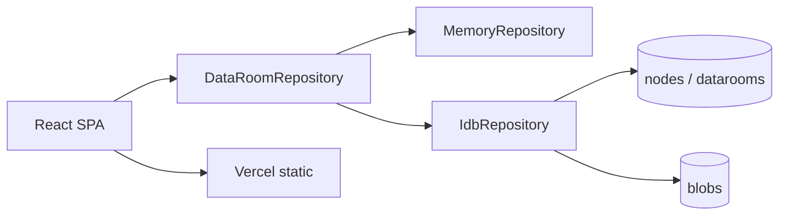

# Acme Virtual Data Room — Product & Engineering Specification

**Version:** 1.0  
**Date:** 2026-08-10  
**Project:** `tailored-tech-test`  
**Status:** Ready for implementation  

**Sources of truth**

| Doc | Role |
|-----|------|
| [`docs/test-task.md`](./test-task.md) | Take-home brief (non-negotiable TQ) |
| [`docs/research/02-deep-research-report.md`](./research/02-deep-research-report.md) | Architecture & UX research |
| [`docs/research/03-decisions.md`](./research/03-decisions.md) | Locked decisions |
| [`docs/research/05-acceleration-playbook.md`](./research/05-acceleration-playbook.md) | Build speed / slices |
| **This file** | Implementable specification |

---

## 1. Purpose

Build a **Virtual Data Room MVP** for Acme Corp. due diligence: a Drive-like SPA where users create top-level Data Rooms, organize nested folders, and upload/view/manage PDF documents.

### 1.1 Evaluation priorities (from TQ — do not reorder)

1. **User experience & functionality** — intuitive flows, edge cases, error states  
2. **Design & polish** — clean UI; **no unimplemented features**  
3. **Code quality & readability**

### 1.2 Timebox

Target **4–6 hours**. Spec is sized for that budget (Option A architecture).

### 1.3 Success definition (ship bar)

A reviewer can, on the **hosted URL**, without setup:

1. Create a Data Room  
2. Create nested folders  
3. Upload a PDF, preview it, rename it, delete it  
4. Upload a second PDF with the same filename → auto-renamed  
5. Delete a folder → nested folders and files removed  
6. Refresh the page → data still present (IndexedDB) **or** README explicitly documents memory-only kill-switch  

Plus: GitHub repo + README with design decisions and setup.

---

## 2. Goals & non-goals

### 2.1 Goals

- End-to-end SPA for Data Room CRUD + nested folder/file CRUD  
- PDF-only uploads with in-app viewing  
- Clear same-name and cascade-delete behavior  
- Mobile-first, usable on desktop  
- Free hosting (Vercel Hobby)  
- Client-side persistence (IndexedDB) as allowed mock  

### 2.2 Non-goals (explicitly out of MVP)

| Out of scope | Why |
|--------------|-----|
| Auth / multi-user / sharing / permissions | Optional only; steals UX time |
| Cloud blob backend (Supabase/R2/S3) as Must | TQ allows browser mock |
| Full-text PDF content search | Optional; expensive |
| Soft delete / trash / versioning / audit log | Not in TQ |
| Non-PDF file types | TQ: PDF only |
| Next.js / SSR | TQ: SPA |
| Unimplemented nav (Share, Roles, etc.) | Violates polish priority |

### 2.3 Progressive enhancements (ordered ROI)

| Priority | Feature | When |
|----------|---------|------|
| Should | Move via dialog (baseline) | After Must CRUD |
| Should | Move via `@dnd-kit` (enhancement) | If time + dialog works |
| Should | Kebab / context actions | Nice polish |
| Extra | Filename filter (client) | After hosted Must smoke |
| Extra | Supabase Storage sync | XOR with search; only if spare |
| Extra | Auth | Last resort |

---

## 3. Personas & primary journeys

### 3.1 Persona

**Diligence analyst (demo user)** — needs a clean room of folders and PDFs quickly; uses laptop and phone; expects Drive-like navigation.

### 3.2 Journey A — Create and populate a room

```
Home → Create Data Room → Open room → New folder → Enter folder
  → Upload PDF → Preview → Rename → Back via breadcrumb
```

### 3.3 Journey B — Nested structure & cascade

```
Room root → Folder A → Folder B → upload files
  → Navigate to A → Delete A → confirm → A, B, and files gone
```

### 3.4 Journey C — Same-name upload

```
Upload report.pdf → Upload report.pdf again
  → Second becomes "report (1).pdf" → toast explains rename
```

### 3.5 Journey D — Relocate (Should)

```
Select file/folder → Move to… → pick destination folder
  → Invalid (into self/descendant) blocked with toast
```

---

## 4. Information architecture & screens

### 4.1 Screens

| Screen ID | Name | Description |
|-----------|------|-------------|
| S1 | Data Rooms Home | List of rooms; create; open; optional seed |
| S2 | Room Browser | Current folder contents; breadcrumbs; toolbar |
| S3 | PDF Preview | Sheet/modal/panel with iframe + open/download |
| S4 | Dialogs | Create/rename/delete confirm/move |

**No separate settings, auth, or share screens.**

### 4.2 Navigation model

- **Single-pane** list (Drive-like), not Miller columns, not dual tree+list (tree optional later — skip for MVP).  
- **Breadcrumbs:** Data Room name → ancestor folders → current.  
- Tap/click folder → enter. Tap/click file → preview.  
- Back: breadcrumb parent or browser back if using URL state.

### 4.3 Responsive layout

| Viewport | Layout |
|----------|--------|
| Mobile (&lt;768px) | Full-width list; sticky toolbar; preview as bottom sheet / full-screen |
| Desktop (≥768px) | Same list, wider row density; preview as side sheet or centered dialog |

---

## 5. Functional requirements

Each requirement: **ID · Priority · Acceptance criteria**.

### 5.1 Data Rooms

| ID | Requirement | Priority | Acceptance |
|----|-------------|----------|------------|
| DR-01 | Create Data Room with name | Must | Valid non-empty name → room appears in S1 |
| DR-02 | List Data Rooms | Must | Sorted by `createdAt` desc (or name — pick one, document) |
| DR-03 | Open Data Room | Must | Opens S2 at room root (`parentId = null`) |
| DR-04 | Empty home state | Must | CTA “Create Data Room” + optional “Load sample” |
| DR-05 | Sample seed | Should | Creates demo room with 2 nested folders + placeholder note or tiny PDF if available |

*Rename/delete room:* not required by TQ. **Spec decision:** support **delete room** (cascade all nodes+blobs) as polish if cheap; skip rename room if time-tight. Prefer delete room over leaving orphan UI.

| ID | Requirement | Priority | Acceptance |
|----|-------------|----------|------------|
| DR-06 | Delete Data Room | Should | Confirm → removes room + all nodes/blobs |

### 5.2 Folders

| ID | Requirement | Priority | Acceptance |
|----|-------------|----------|------------|
| FO-01 | Create folder in current directory | Must | Appears in list; type=folder |
| FO-02 | Nest folders | Must | Create folder inside another folder |
| FO-03 | View folder contents | Must | Lists child folders and files only |
| FO-04 | Rename folder | Must | Dialog; applies collision policy |
| FO-05 | Delete folder | Must | Confirm with count; cascade deletes descendants + blobs |
| FO-06 | Empty folder state | Must | Message + actions (New folder / Upload) |

### 5.3 Files (PDF)

| ID | Requirement | Priority | Acceptance |
|----|-------------|----------|------------|
| FI-01 | Upload PDF via file picker | Must | `accept=".pdf,application/pdf"` |
| FI-02 | Upload via drag-drop onto browser area | Should | Same validation as picker |
| FI-03 | Reject non-PDF | Must | Toast; nothing stored |
| FI-04 | Size cap | Must | Reject above **20 MB** with toast (tunable 15–25) |
| FI-05 | View PDF in UI | Must | Object URL in iframe/sheet; revoke on close |
| FI-06 | Mobile fallback | Must | “Open in new tab” + “Download” always available |
| FI-07 | Rename file | Must | Collision policy; keep `.pdf` extension sane |
| FI-08 | Delete file | Must | Confirm optional for single file; removes metadata + blob |
| FI-09 | Show size / date in row | Should | Human-readable size |

### 5.4 Naming & collisions

| ID | Requirement | Priority | Acceptance |
|----|-------------|----------|------------|
| NA-01 | Unique names per parent | Must | Case-sensitive uniqueness within `(dataroomId, parentId)` |
| NA-02 | Auto-rename on conflict | Must | `name.ext` → `name (1).ext` → `name (2).ext` … |
| NA-03 | Notify user on auto-rename | Must | Toast: “Saved as …” |
| NA-04 | Trim whitespace; reject empty names | Must | Validation error |

**Algorithm (`uniqueName`):**

1. If `desired` free under parent → use it.  
2. Split base + extension (`report` + `.pdf`; folders have no ext or treat whole string as base).  
3. Try `base (n).ext` for n = 1, 2, … until free.  
4. Return final name.

### 5.5 Cascade delete

| ID | Requirement | Priority | Acceptance |
|----|-------------|----------|------------|
| CA-01 | Collect all descendants | Must | BFS/DFS from folder id within same dataroom |
| CA-02 | Delete blobs for file nodes | Must | No orphan blobs in IDB |
| CA-03 | Delete all descendant nodes + folder | Must | Repo list empty of those ids |
| CA-04 | Confirm copy | Must | “Delete **{name}** and **N** items inside?” |

### 5.6 Move (Should)

| ID | Requirement | Priority | Acceptance |
|----|-------------|----------|------------|
| MV-01 | Move file to another folder (same room) | Should | `parentId` updated; collision rename if needed |
| MV-02 | Move folder to another folder | Should | Same; **block** if target is self or descendant |
| MV-03 | Move via dialog | Should | Default implementation |
| MV-04 | Move via drag-and-drop | Should+ | `@dnd-kit`; does not replace MV-03 |

### 5.7 Search (Extra)

| ID | Requirement | Priority | Acceptance |
|----|-------------|----------|------------|
| SE-01 | Filter current folder by name substring | Extra | Case-insensitive; clears easily |
| SE-02 | Global search in room | Extra | Optional; skip if tight |
| SE-03 | Content search inside PDFs | Skip | Out of scope |

### 5.8 Deliverables

| ID | Requirement | Priority | Acceptance |
|----|-------------|----------|------------|
| DL-01 | GitHub repository | Must | Code + docs |
| DL-02 | README design decisions + setup | Must | See §15 |
| DL-03 | Hosted URL (Vercel) | Must | Public HTTPS |

---

## 6. Domain model

### 6.1 Entities

```ts
type Id = string // uuid/ulid

interface DataRoom {
  id: Id
  name: string
  createdAt: number // epoch ms
}

type NodeType = 'folder' | 'file'

interface Node {
  id: Id
  dataroomId: Id
  parentId: Id | null // null = room root
  type: NodeType
  name: string
  mimeType?: 'application/pdf'
  size?: number // bytes
  blobKey?: string // typically === id for files
  createdAt: number
  updatedAt: number
}
```

### 6.2 Invariants

1. Every `Node.dataroomId` references an existing `DataRoom`.  
2. If `parentId !== null`, parent exists, is `type === 'folder'`, same `dataroomId`.  
3. No cycles in folder parent chain.  
4. Names unique among siblings (`dataroomId + parentId + name`).  
5. Files always `mimeType === 'application/pdf'` and have a blob.  
6. Hard delete only (no `deletedAt`).

### 6.3 IndexedDB schema

**DB name:** `acme-dataroom`  
**Version:** `1`

| Store | KeyPath | Indexes |
|-------|---------|---------|
| `datarooms` | `id` | `createdAt` |
| `nodes` | `id` | `dataroomId`, `byParent`=`[dataroomId+parentId]`, `byName`=`[dataroomId+parentId+name]` |
| `blobs` | key = `blobKey` / file `id` | — |

`parentId` null stored as sentinel string `"root"` in compound index **or** separate query path — implementer choice; document in code.

---

## 7. Repository API (contract)

UI talks only to `DataRoomRepository` (name flexible). Persistence behind interface.

```ts
interface DataRoomRepository {
  // Rooms
  listRooms(): Promise<DataRoom[]>
  createRoom(name: string): Promise<DataRoom>
  deleteRoom(id: Id): Promise<void> // cascade all

  // Navigation
  listChildren(dataroomId: Id, parentId: Id | null): Promise<Node[]>
  getNode(id: Id): Promise<Node | null>
  getBreadcrumbs(dataroomId: Id, folderId: Id | null): Promise<Node[]> // ancestors

  // Folders
  createFolder(dataroomId: Id, parentId: Id | null, name: string): Promise<Node>
  renameNode(id: Id, name: string): Promise<Node>
  deleteFolder(id: Id): Promise<void> // cascade

  // Files
  uploadFile(
    dataroomId: Id,
    parentId: Id | null,
    file: File
  ): Promise<Node> // validates PDF, collision, stores blob
  getFileBlob(id: Id): Promise<Blob>
  deleteFile(id: Id): Promise<void>

  // Move
  moveNode(id: Id, newParentId: Id | null): Promise<Node>

  // Optional seed
  seedSample?(): Promise<DataRoom>
}
```

**Implementations**

1. `MemoryRepository` — first vertical slices  
2. `IdbRepository` — shipping default  

Same interface; swap at app bootstrap.

---

## 8. UX specification

### 8.1 Visual direction

- Clean, neutral, document-product feel (Drive/Dropbox-inspired).  
- shadcn/ui + Tailwind; consistent spacing, one accent.  
- **No** decorative fake chrome that implies missing features.  
- Prefer lucide icons via shadcn defaults.

### 8.2 Toolbar actions (S2)

Visible only if implemented:

- New folder  
- Upload PDF  
- (Should) Move — when row selected **or** per-row menu  
- (Extra) Search input  

### 8.3 Row actions

Per folder/file row:

- Open / Preview (primary click)  
- Rename  
- Delete  
- Move… (Should)  

Prefer **dropdown kebab** over overcrowding toolbar.

### 8.4 Feedback

| Event | UI |
|-------|-----|
| Success create/upload/rename | Toast (sonner) |
| Auto-rename | Toast with final name |
| Validation fail | Toast or inline |
| Destructive | AlertDialog confirm |
| Loading list | Skeleton or spinner |
| Persistence error / quota | Toast + keep UI usable |

### 8.5 Drag-and-drop (Should+)

| Rule | Spec |
|------|------|
| Library | `@dnd-kit/core` |
| Desktop activate | Pointer distance ≥ 8px |
| Touch activate | Delay 200–250ms, tolerance 5–8px |
| Prefer | Drag handle on mobile |
| Drop target | Folder rows only |
| Invalid | Self, descendant, non-folder → no drop / toast |
| Click vs drag | Simple tap never starts drag |

**Kill-switch:** ship MV-03 dialog only; omit DnD; document in README.

### 8.6 PDF preview

1. Create `objectURL` from blob.  
2. Render `<iframe title={name} src={objectURL} />` in Sheet/Dialog.  
3. Buttons: Open in new tab, Download, Close.  
4. `URL.revokeObjectURL` on unmount/close.  
5. Do **not** adopt pdf.js unless iframe fails on target browsers.

---

## 9. Component inventory (granular)

```
AppShell
  DataRoomList
    DataRoomCard / DataRoomRow
    CreateRoomDialog
    EmptyRoomsState
    SeedSampleButton
  RoomLayout
    Breadcrumbs
    Toolbar
      NewFolderButton
      UploadPdfButton
      (SearchInput)
    NodeList
      FolderRow
      FileRow
      NodeActionsMenu
      (DropIndicator)
    EmptyFolderState
    PdfPreviewSheet
  dialogs/
    RenameDialog
    DeleteConfirmDialog
    MoveDialog
    CreateFolderDialog
```

Domain (non-UI): `types`, `naming`, `cascade`, `validatePdf`.

---

## 10. Architecture

### 10.1 Option A (locked)



### 10.2 App state

- Prefer React state/context or lightweight reducer holding:
  - `currentRoomId`
  - `currentParentId`
  - `children` cache
  - `previewFileId`
- Avoid extra state libraries unless clearly needed.

### 10.3 Routing

Minimal:

- `/` — rooms home  
- `/rooms/:roomId` — room root  
- `/rooms/:roomId/folders/:folderId` — nested  

Or hash-based equivalent. Deep-link optional but nice for polish.

---

## 11. Tech stack (locked)

| Layer | Choice |
|-------|--------|
| Bundler / SPA | Vite |
| UI | React 18/19 + TypeScript |
| Styling | Tailwind CSS |
| Components | shadcn/ui |
| Persistence | `idb` (preferred) or Dexie |
| DnD | `@dnd-kit/core` (+ utilities) when implementing MV-04 |
| Hosting | Vercel Hobby |
| Package manager | npm (or pnpm — pick one, stick to it) |

**Scaffold (preferred):** `npx shadcn@latest init -t vite`  
**Fallback:** `npm create vite@latest` → Tailwind → `shadcn init`  
See acceleration playbook for component add list.

---

## 12. Error & edge-case catalog

| Case | Behavior |
|------|----------|
| Empty room name | Block submit |
| Empty folder/file name | Block submit |
| Duplicate sibling name | Auto-suffix `(n)` + toast |
| Non-PDF upload | Reject + toast |
| File &gt; 20 MB | Reject + toast |
| IDB quota exceeded | Toast; suggest delete files |
| Delete folder with children | Confirm with count; cascade |
| Move into descendant | Block + toast |
| Preview missing blob | Error state + close |
| Private browsing / IDB unavailable | Fall back memory + banner in UI + README |

---

## 13. Non-functional requirements

| ID | Requirement |
|----|-------------|
| NF-01 | Works in latest Chrome + Safari (desktop); usable mobile Safari/Chrome |
| NF-02 | No paid services required to run demo |
| NF-03 | First meaningful paint usable on mid mobile |
| NF-04 | TypeScript strict enough for readable domain types |
| NF-05 | No secrets in client (none needed for Option A) |
| NF-06 | Accessibility pragmatic: buttons labeled, dialogs focus-trapped (shadcn), keyboard reachable primary actions |

---

## 14. Testing strategy (pragmatic for take-home)

**Must (manual):** reviewer smoke list in §1.3 / playbook §8.  

**Should (cheap automated):**

- Unit: `uniqueName`, `collectDescendants`, cycle check for move  
- Optional: Vitest on domain only  

Skip E2E framework unless time surplus.

---

## 15. README requirements (deliverable)

Must include:

1. Live URL  
2. Priorities mapping (UX → polish → code)  
3. Stack + why Vite SPA + IndexedDB  
4. Data model summary + cascade + collision policy  
5. PDF viewing approach  
6. Move / DnD decision  
7. Out of scope list  
8. Setup: install + `npm run dev`  
9. Suggested demo path (“What to try”)  

Template: see [`docs/research/05-acceleration-playbook.md`](./research/05-acceleration-playbook.md) § README skeleton.

---

## 16. Implementation plan (binding)

Align with acceleration slices:

| Slice | Deliverable | Exit criteria |
|-------|-------------|---------------|
| 0 | Scaffold + shell | `dev` runs |
| 1 | Domain + MemoryRepository | Collision + cascade smoke |
| 2 | Rooms UI | Create/open rooms |
| 3 | Folder CRUD + breadcrumbs | Nest + cascade in UI |
| 4 | PDF upload/view/rename/delete | Duplicate name OK |
| 5 | Empty/error/seed | No dead buttons |
| 6 | IdbRepository | Persist across refresh |
| 7 | Move dialog (± DnD) | No cycles |
| 8 | README + Vercel | Reviewer checklist |

**Parallel:** GitHub + Vercel after Slice 2.  
**Hard stop ~5:00:** README + deploy only.  
**Kill switches:** DnD→dialog; IDB→memory+README; Extra = search XOR Supabase.

---

## 17. Acceptance test script (QA)

Run on production URL:

| # | Step | Expected |
|---|------|----------|
| 1 | Load app | Home renders; no console fatal |
| 2 | Create room “Acme DD” | Appears in list |
| 3 | Open room | Empty state with CTAs |
| 4 | New folder “Legal” | Row appears |
| 5 | Enter Legal → New folder “Contracts” | Nested OK |
| 6 | Upload `a.pdf` | Listed; preview opens |
| 7 | Upload `a.pdf` again | `a (1).pdf`; toast |
| 8 | Rename file | New name in list |
| 9 | Delete file | Gone; preview closed |
| 10 | From Legal delete folder | Contracts + contents gone |
| 11 | Refresh | Structure persists |
| 12 | Mobile width | Usable list + preview fallback |
| 13 | (Should) Move file | Appears under new parent |
| 14 | (Should+) DnD | Same as move; scroll still works |

---

## 18. Risks & mitigations

| Risk | Mitigation |
|------|------------|
| shadcn init fails | Fallback Vite path immediately |
| Safari iframe PDF flaky | Open/Download buttons always |
| Touch DnD fights scroll | Delay sensor + handle; or dialog only |
| IDB quota | 20 MB cap; clear errors |
| Over-scope | This spec’s non-goals + kill switches |
| Deploy left to end | Vercel after Slice 2 |

---

## 19. Glossary

| Term | Meaning |
|------|---------|
| Data Room | Top-level container (virtual drive) |
| Node | Folder or file row in the tree |
| Cascade delete | Delete folder and all nested nodes/blobs |
| Option A | Client-only IndexedDB architecture |
| Should+ | Should item that is progressive enhancement on another Should |

---

## 20. Change control

- TQ (`test-task.md`) wins on conflict with this spec.  
- Locked stack/decisions win on conflict with exploratory ideas.  
- Spec updates only when TQ interpretation or kill-switch activates (document in README).

### 20.1 Sync after editing this SPEC

1. Update [`docs/research/07d-impl-kb-adr-dod.md`](./research/07d-impl-kb-adr-dod.md) (ADR + DoD) **first**  
2. Then slices [`07c`](./research/07c-impl-kb-slices.md), then domain/components KB as needed  
3. Log a Changelog bullet in `07d`  

Agents: follow `.cursor/rules/spec-sync.mdc`. Coding: `.cursor/rules/slice-first-kb.mdc` (do not load entire KB).

**Document owner:** project implementer  
**Next step:** Execute Slice 0 using Implementation KB — [`docs/research/07-implementation-kb.md`](./research/07-implementation-kb.md) (+ [`05-acceleration-playbook.md`](./research/05-acceleration-playbook.md)).
