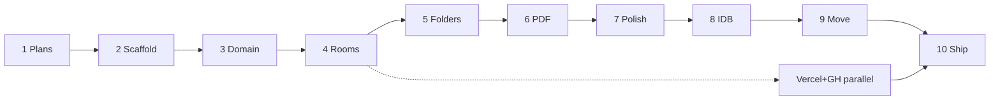

# Roadmap — concrete implementation

| # | Етап | Вихід (done when) | Est. | Access |
|---|------|-------------------|------|--------|
| 1 | Plans + checklists | `docs/plans/*` | 15m | — |
| 2 | Slice 0 Scaffold | `npm run build` OK, App shell | 30m | — |
| 3 | Slice 1 Domain+Memory | unit/smoke naming+cascade | 30m | — |
| 4 | Slice 2 Rooms UI | create/list/open rooms | 25m | GH (repo) |
| 5 | Slice 3 Folders | nest/rename/cascade UI | 50m | — |
| 6 | Slice 4 PDF | upload/view/rename/delete + `(n)` | 45m | — |
| 7 | Slice 5 Polish/seed | empty states, seed, delete room | 25m | — |
| 8 | Slice 6 IndexedDB | persist across refresh | 35m | — |
| 9 | Slice 7 Move dialog (±DnD) | move without cycles | 40m | — |
| 10 | Slice 8 README + deploy | Live URL + README | 40m | **Vercel** |

**Total Must stages: 10.** Supabase = optional Extra — **не блокує** MVP.

## Phase B — Post-Must (Extra / Should ROI)

| # | Етап | Вихід | Est. |
|---|------|-------|------|
| 11 | Filename filter + PDF drop-on-browser | SE-01, FI-02 | 30m |
| 12 | DnD move via `@dnd-kit` (dialog remains) | MV-04 | 45m |
| 13 | Ship Extra to prod | Live updated | 10m |

Skip: Auth, Supabase, content PDF search — **reopened as Phase D by owner (2026-08-10).**

## Phase C — Code quality / granular components (TQ priority #3)

| # | Етап | Вихід | Est. |
|---|------|-------|------|
| 14 | Sync checklists to reality | CHECKLISTS accurate | 5m |
| 15 | Split RoomBrowser → NodeRow, PdfPreview, dialogs | granular comps | 40m |
| 16 | Ship Phase C | Live + README note | 10m |

## Phase D — Owner order: FTS → Supabase → Auth

| # | Етап | Вихід | Est. | Access |
|---|------|-------|------|--------|
| 17 | Full-text PDF: extract on upload, search in room | SE-03 | 60–90m | — |
| 18 | Ship FTS | Live | 10m | — |
| 19 | Supabase project: tables + Storage bucket | schema live | 45m | **Supabase** |
| 20 | `SupabaseRepository` + bootstrap switch | cloud persist | 90m | anon key in Vercel env |
| 21 | Auth (magic link first; OAuth if easy) | gated rooms per user | 60–90m | Auth enabled |
| 22 | Ship + README | Live secured | 20m | — |

## Parallel track (з етапу 4)

- `git init` / commit  
- `gh repo create`  
- Vercel project link + deploy preview/prod  

## Kill switches (не змінюють номер етапу)

| Trigger | Action |
|---------|--------|
| DnD fails | Ship Move dialog only |
| IDB fails | Memory + README banner |
| Time overrun | Skip Should/Extra; jump to stage 10 |
