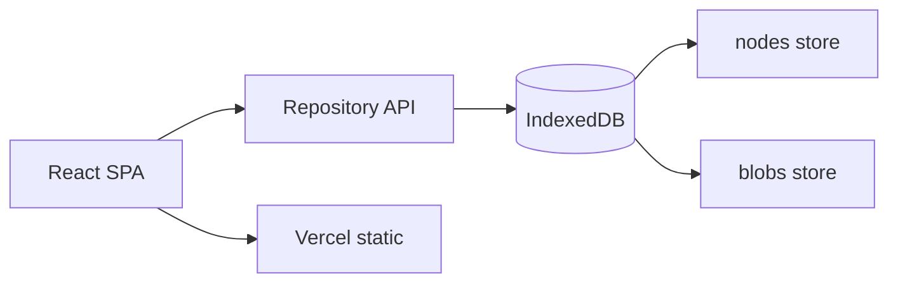
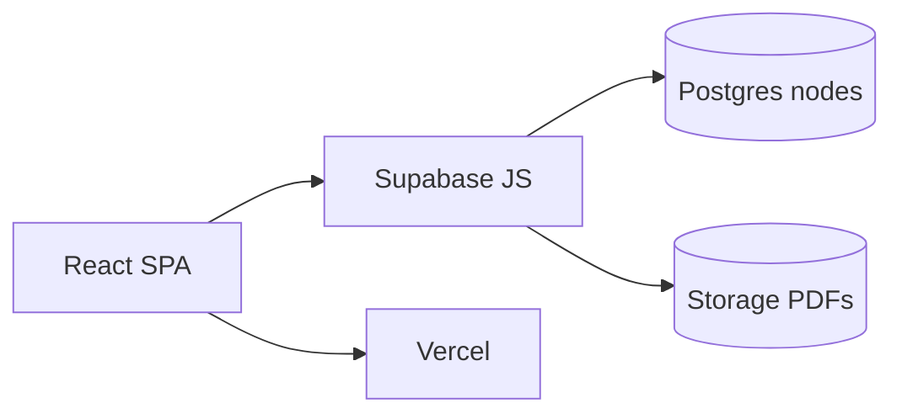
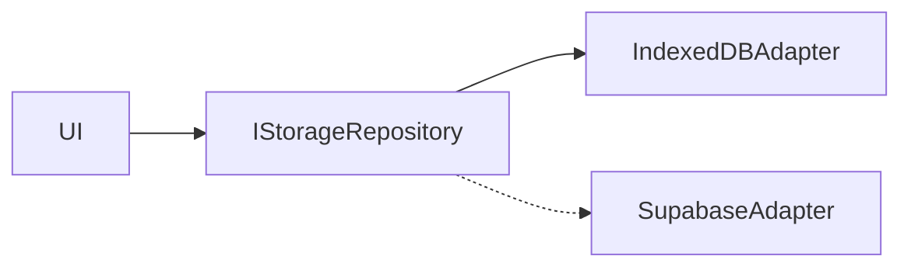

# Deep research report — Data Room MVP

**Дата:** 2026-08-10  
**Проєкт:** `tailored-tech-test`  
**ТЗ:** [`docs/test-task.md`](../test-task.md)  
**Бюджет:** 4–6 годин  
**Статус лімітів:** best-known на дату дослідження — **verify before commit** на офіційних pricing pages.

---

## 1. Executive recommendation

Take-home оцінює **UX → polish → code**, не infra. ТЗ дозволяє mock PDF у браузері. Години краще витратити на Drive-like флоу, empty/error states, cascade delete, same-name policy і **mobile+desktop DnD**, а не на Auth/RLS.

| Рішення | Вибір |
|---------|--------|
| Framework | **Vite SPA** (не Next — ТЗ каже SPA) |
| UI | React + TypeScript + Tailwind + **shadcn/ui** |
| Persistence (Must) | **IndexedDB** (metadata + PDF Blobs) через `idb` або Dexie |
| Hosting | **Vercel Hobby** |
| DnD | **`@dnd-kit/core`** (+ sortable за потреби); TouchSensor delay 200–250ms |
| PDF view | `URL.createObjectURL(blob)` → `<iframe>` / Open in new tab |
| Cloud files (Extra) | **Supabase Storage** (+ Postgres metadata), лише якщо лишився час |
| Auth / R2 / S3 | Skip у 6h (Auth — last resort extra) |

**Коли відхилятися на Supabase:** лише після Must UX і ≥60–90 хв запасу.

---

## 2. Scope matrix

| Feature | Must | Should | Extra | Skip | Est. hours |
|---------|------|--------|-------|------|------------|
| Vite+TS+Tailwind+shadcn scaffold | ✓ | | | | 0.5 |
| DataRooms list + create | ✓ | | | | 0.4 |
| Nested folders CRUD + breadcrumbs | ✓ | | | | 1.0 |
| Cascade delete + confirm dialog | ✓ | | | | 0.3 |
| PDF upload (accept only) + rename/delete | ✓ | | | | 0.6 |
| Same-name policy (auto-suffix) | ✓ | | | | 0.2 |
| PDF view (blob URL / iframe) | ✓ | | | | 0.3 |
| Empty + error + loading states | ✓ | | | | 0.4 |
| IndexedDB persist (meta + blobs) | ✓ | | | | 0.5 |
| Move via DnD (file/folder → folder) | | ✓ | | | 1.0–1.5 |
| Context menu / kebab actions | | ✓ | | | 0.3 |
| Filename search (client filter) | | | ✓ | | 0.3 |
| Vercel deploy + README | ✓ | | | | 0.4 |
| Supabase Storage + sync | | | ✓ | | 1.5–2.5 |
| Auth (magic link / OAuth) | | | ✓ | | 1.0+ |
| Content/full-text search | | | | ✓ | — |
| Permissions / audit / versioning | | | | ✓ | — |
| Multi file types | | | | ✓ | — |

**Kill order якщо не встигаєш:** search → cloud storage → auth → навіть DnD (замінити на “Move to…” dialog) → зайвий polish.

---

## 3. Architecture options

### A — Pure client mock (**рекомендовано**)



- **Free-tier fit:** лише Vercel Hobby; нуль backend cost
- **Time:** ~4–5.5 h до polished Must+Should
- **Risk:** дані лише в цьому браузері; Safari quota/eviction; немає cross-device

### B — Supabase Postgres + Storage + Vercel



- **Free (verify):** ~500 MB DB, **1 GB** file storage, **50 MB** max upload, ~5 GB egress; free projects можуть **pause після ~1 week** inactivity — див. [supabase.com/pricing](https://supabase.com/pricing)
- **Time:** +1.5–2.5 h
- **Risk:** paused project для reviewer; RLS complexity; auth creep

### C — Hybrid adapter (local-first, cloud later)



- **Time:** +0.5–1 h за interface; повний dual ≈ B
- **Ризик:** напівготовий adapter гірше за солідний A — шип **interface + IndexedDB only**, у README: “swap to Supabase Storage here”

| Option | Pick when |
|--------|-----------|
| **A** | Default для 4–6 h |
| **B** | Extra credit + публічне shared demo |
| **C** | Чиста code narrative без повного B |

---

## 4. File storage deep-dive

*Ліміти — best-known на 2026-08-10. Verify before commit.*

| Option | Free limits (approx.) | Auth needed? | Works with Vercel? | Fit for take-home? | Gotchas |
|--------|----------------------|--------------|--------------------|--------------------|---------|
| **Browser memory only** | Session RAM | No | Yes | Weak alone | Lost on refresh |
| **IndexedDB (+ Blob)** | Origin quota; Chrome ~60% disk; Safari historically tighter | No | Yes | **Best for Must** | Eviction; private mode; not cross-device |
| **Supabase Storage** | **1 GB** storage; **50 MB**/file; egress у спільному ~**5 GB** | Anon OK для open demo; RLS краще з auth | Yes (FE only) | **Best optional cloud** | Project pause ~7d idle |
| **Vercel Blob** | Hobby free within shared usage; у pricing example часто ~**5 GB** storage / ops / transfer — *confirm* | Token / client upload | Native | OK якщо вже на Vercel | Shared Hobby caps; exceed → Blob blocked ~30d |
| **Cloudflare R2** | **10 GB**; 1M Class A; 10M Class B; **egress $0** | S3 API keys / Worker | Yes via Worker/signed URL | Strong storage, **weak timebox** | Extra CF account; CORS; Worker |
| **AWS S3** | New accounts: credits model (не classic forever 5 GB) — *verify* | IAM | Yes | **Skip** | Account + billing fear + CORS time |

### Де саме зберігати файли (plain answer)

1. **MVP (Must):** browser **IndexedDB** (Blob per file id)
2. **Extra credit:** **Supabase Storage** bucket `dataroom-files/{dataroomId}/{fileId}.pdf` + metadata в Postgres
3. **Не:** «на Vercel як filesystem» — Vercel хостить SPA; blobs = Blob product або зовнішній object store

### Джерела для verify

- [Supabase Pricing](https://supabase.com/pricing)
- [Vercel Blob usage & pricing](https://vercel.com/docs/vercel-blob/usage-and-pricing)
- [Cloudflare R2 pricing](https://developers.cloudflare.com/r2/pricing/)
- [MDN Storage quotas](https://developer.mozilla.org/en-US/docs/Web/API/Storage_API/Storage_quotas_and_eviction_criteria)

---

## 5. DnD / mobile-first UX

### Recommended library

**`@dnd-kit/core`** (+ `@dnd-kit/sortable` якщо reorder). Pointer-events based → touch/keyboard без HTML5 DnD iOS pain.

**Не брати як primary:** Pragmatic Drag and Drop / raw HTML5 — native quirks на mobile.

### Interaction model

| Input | Behavior |
|-------|----------|
| Click / tap | Open folder or preview PDF (не старт drag) |
| Desktop | `PointerSensor` + `activationConstraint: { distance: 8 }` |
| Touch | `TouchSensor` + `delay: 200–250`, `tolerance: 5–8` |
| Mobile polish | Drag **handle** (⋮⋮) — менше конфліктів зі scroll |
| Drop | Highlight folder; reject self/descendant; toast on invalid |
| Keyboard (pragmatic) | “Move to…” dialog — повний keyboard DnD дорого |

### IA

- **Mobile:** single-column list + **breadcrumbs** + back (Drive-like). Без Miller columns.
- **Desktop:** той самий list, ширша density; left tree — лише якщо час (часто skip).

### Anti-patterns

- Native HTML5-only DnD
- `touch-action: none` на весь список (вбиває scroll)
- Unimplemented Share / Permissions buttons
- Drag що також тригерить navigation

### Minimal component breakdown

```
AppShell
  DataRoomList
  RoomLayout
    Breadcrumbs
    Toolbar
    NodeList
      FolderRow / FileRow
      DropIndicator
    PdfPreviewDrawer
    dialogs/*
```

---

## 6. Data model & edge-case policies

### Schema (flat adjacency list)

```text
DataRoom {
  id: string
  name: string
  createdAt: number
}

Node {
  id: string              // ulid/uuid
  dataroomId: string
  parentId: string | null // null = room root
  type: 'folder' | 'file'
  name: string
  mimeType?: 'application/pdf'
  size?: number
  blobKey?: string        // IndexedDB blobs key === file id
  createdAt: number
  updatedAt: number
}
```

**Indexes:** `(dataroomId, parentId)`, `(dataroomId, parentId, name)`.

### Name collision — recommended

У межах одного `parentId` імена унікальні (case-sensitive). При конфлікті → auto-rename:

`Report.pdf` → `Report (1).pdf` → `Report (2).pdf`

Альтернативи: reject з error; overwrite з confirm (ризиковано для VDR).

### Cascade delete

BFS/DFS → зібрати descendant ids → delete blob keys для files → delete nodes. Confirm: “Delete folder and N items?”

### Delete policy

**Hard delete** для MVP (без trash). Soft delete = зайвий scope.

### Move invariant

Оновити `parentId`; заборонити cycles (`target` не в descendants dragged folder).

---

## 7. PDF view strategy

1. Store `Blob` in IDB; on view: `URL.createObjectURL(blob)`
2. Desktop: side panel / modal `<iframe src={url} />`
3. Mobile Safari fallback: **Open in new tab** + **Download**
4. `revokeObjectURL` on close/unmount
5. Skip full `pdf.js` unless iframe fails spike

Upload: `accept="application/pdf,.pdf"` + MIME/extension check; reject others з toast. Cap size ~15–25 MB для MVP.

---

## 8. Free hosting & deploy checklist

### Path A (default)

1. `npm create vite@latest` → React-TS
2. Tailwind + shadcn init
3. GitHub repo
4. Vercel import → Vite → deploy
5. README: decisions, collision policy, local-only warning, setup

### Env

- **A:** none
- **B:** `VITE_SUPABASE_URL`, `VITE_SUPABASE_ANON_KEY` (ніколи service role у клієнті)

### Reviewer first clicks

1. Hosted URL loads  
2. Create Data Room  
3. Nested folder + upload PDF + preview  
4. Rename / duplicate-name upload  
5. Delete folder cascade  
6. (Bonus) DnD move on phone + desktop  

Якщо B — ping Supabase project перед сабмітом (уникнути pause).

---

## 9. 6-hour execution plan

| Window | Work | Kill-switch |
|--------|------|-------------|
| **0:00–0:45** | Scaffold Vite/TS/TW/shadcn; types; in-memory repo; room list + folder nav | Scaffold >45m → drop shadcn, plain TW |
| **0:45–2:15** | Full folder/file CRUD; cascade; collision; empty/error | |
| **2:15–3:00** | IndexedDB + PDF blob upload/view | IDB pain → memory + note in README |
| **3:00–4:00** | Polish: breadcrumbs, dialogs, PDF panel, responsive | |
| **4:00–5:00** | DnD move (dnd-kit) | iOS broken at :30 → “Move to…” only |
| **5:00–5:30** | README + Vercel + smoke | **Must ship by here** |
| **5:30–6:00+** | Extra: filename filter **або** Supabase Storage — не обидва | Stop; не стартувати Auth |

---

## 10. Open questions / spikes (30–60 min)

1. iPhone Safari: upload 5–10 MB PDF → IDB → iframe (15 min)
2. dnd-kit TouchSensor на реальному девайсі: scroll vs long-press (15 min)
3. Confirm Supabase free limits на pricing page (5 min) — лише якщо B
4. Vite + shadcn на поточній Node (10 min)
5. Collision copy: ` (n)` vs ` - copy`

---

## Root-cause framing (чому take-home провалюють)

| Failure | Cause | Avoid |
|---------|-------|-------|
| Pretty shell, broken CRUD | Time on design system | CRUD first |
| Auth+RLS, weak UX | Extra credit first | Auth last / skip |
| Desktop DnD only | HTML5 DnD | dnd-kit + delay |
| Empty demo on deploy | No seed path | Sample room button |
| Cloud paused for reviewer | Free idle pause | IndexedDB або ping before send |

---

## README outline (для оцінки)

1. Problem + priorities mapping  
2. Stack + why Vite SPA  
3. Data model + cascade + collision policy  
4. Persistence (IndexedDB; cloud if any)  
5. DnD approach + mobile sensors  
6. PDF viewing choice  
7. Trade-offs / out of scope  
8. Setup + deploy URL  

---

## Risks for build

- IndexedDB-only = немає multi-device demo — сказати в README або додати “Load sample”
- DnD без handle на mobile б’ється зі scroll
- Public Supabase anon без RLS = хто завгодно може стерти demo
- Auto-rename `(n)` треба пояснити в README
