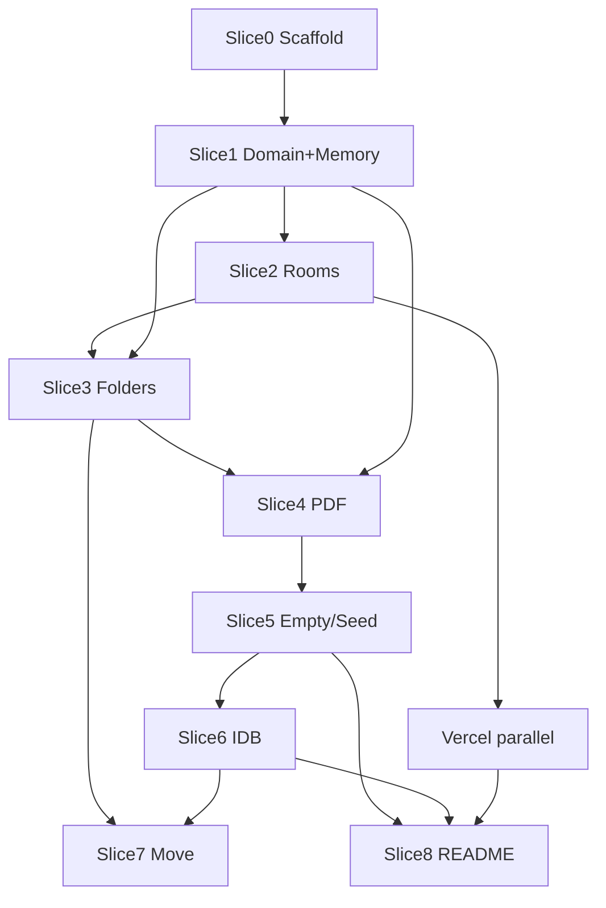

# Implementation KB — Executive map & Traceability

**Parent:** [07-implementation-kb.md](./07-implementation-kb.md)  
**SPEC:** [`docs/SPEC.md`](../SPEC.md)

> Slice-first: цей файл — довідник priority/trace. Під час slice **не читай його цілком** щоразу; відкривай рядок таблиці лише якщо треба прив’язка TQ↔SPEC ID.

---

## 1. Executive impl map

| Порядок | Дія |
|---------|-----|
| 1 | Scaffold (`shadcn init -t vite`) — Slice 0 |
| 2 | Domain pure TS + MemoryRepository — Slice 1 (gates: uniqueName, cascade) |
| 3 | Rooms UI only — Slice 2; **одразу** GitHub + Vercel |
| 4 | Folder CRUD + breadcrumbs — Slice 3 |
| 5 | PDF upload/view/rename/delete — Slice 4 |
| 6 | Empty/error/seed polish — Slice 5 |
| 7 | Swap IdbRepository — Slice 6 |
| 8 | MoveDialog (± dnd-kit) — Slice 7 |
| 9 | README fill + prod smoke — Slice 8 |

**Правило:** UI викликає лише `DataRoomRepository`. Domain helpers — pure functions. Жодних dead buttons. Kill switches: DnD→dialog, IDB→memory+README, після ~5h лише ship.

### Spec → artifacts decomposition

| SPEC section | Impl artifacts |
|--------------|----------------|
| §3 Journeys | App navigation + QA |
| §4 Screens S1–S4 | `rooms/*`, `browser/*`, `pdf/*`, `dialogs/*` |
| §5 Requirements | DoD checkboxes |
| §6 Domain model | `src/domain/types.ts` |
| §5.4–5.5 Algorithms | `naming.ts`, `cascade.ts` |
| §7 Repository | `src/storage/*` |
| §8 UX | component behavior + sonner/alert-dialog |
| §9 Inventory | encyclopedia |
| §11 Stack | package.json / scaffold |
| §16 Slices | runbooks |
| §17 QA | smoke script |

---

## 2. Traceability matrix

| TQ theme | SPEC ID(s) | Module / Component | Slice | QA # | Priority |
|----------|------------|-------------------|-------|------|----------|
| SPA React/TW/shadcn | DL-01, stack | scaffold, AppShell | 0 | 1 | Must |
| Create DataRooms | DR-01..04 | DataRoomList, CreateRoomDialog | 2 | 2–3 | Must |
| Nested folders CRUD | FO-01..06 | RoomLayout, FolderRow, dialogs | 3 | 4–5,10 | Must |
| Cascade delete | CA-01..04 | cascade.ts, DeleteConfirmDialog | 1,3 | 10 | Must |
| PDF upload/view/rename/delete | FI-01,03..08 | UploadPdfButton, FileRow, PdfPreviewSheet | 4 | 6–9 | Must |
| Same-name edge case | NA-01..04 | naming.ts, uploadFile/renameNode | 1,4 | 7 | Must |
| Good data structures | §6–7 | types, repository | 1 | — | Must |
| Granular components | §9 | all UI comps | 2–5 | — | Must |
| Mock CRUD / IDB | persist | memoryRepo → idbRepo | 1,6 | 11 | Must |
| Edge/error states | §8.4, §12 | Empty*, toasts | 5 | 3 | Must |
| README + hosted URL | DL-02, DL-03 | README, Vercel | 2∥,8 | 1 | Must |
| Mobile usable | NF-01, FI-06 | PdfPreviewSheet fallback | 4–5 | 12 | Must |
| Sample seed | DR-05 | SeedSampleButton | 5 | — | Should |
| Delete room | DR-06 | DataRoomRow actions | 5 | — | Should |
| File size/date row | FI-09 | FileRow | 4 | — | Should |
| Upload dropzone | FI-02 | RoomLayout drop zone | 4–7 | — | Should |
| Move dialog | MV-01..03 | MoveDialog | 7 | 13 | Should |
| DnD move | MV-04 | DropIndicator, dnd-kit | 7 | 14 | Should+ |
| Filename filter | SE-01 | SearchInput | Extra | — | Extra |
| Content search | SE-03 | — | — | — | Skip |
| Auth / cloud blob | non-goals | — | — | — | Skip / Extra later |

### Requirement → Slice dependency graph

