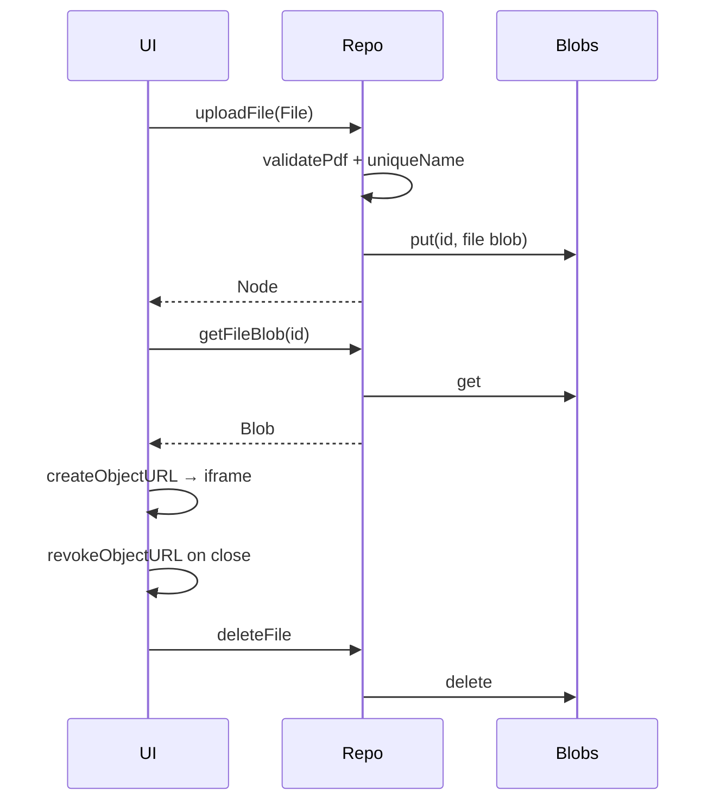

# Implementation KB — Domain & Persistence

**Parent:** [07-implementation-kb.md](./07-implementation-kb.md)

---

## 3. Domain knowledge cards

### 3.1 `src/domain/types.ts`

```ts
type Id = string

interface DataRoom {
  id: Id
  name: string
  createdAt: number
}

type NodeType = 'folder' | 'file'

interface Node {
  id: Id
  dataroomId: Id
  parentId: Id | null
  type: NodeType
  name: string
  mimeType?: 'application/pdf'
  size?: number
  blobKey?: string
  createdAt: number
  updatedAt: number
}
```

**Invariants:** parent folder same room; no cycles; sibling names unique (case-sensitive); files always PDF + blob; hard delete only.

---

### 3.2 `naming.uniqueName`

**Signature:** `uniqueName(desired: string, existingNames: Set<string> | string[]): string`

**Pseudo-code:**

```
desired = trim(desired)
if desired empty → throw ValidationError
if desired not in existing → return desired
{ base, ext } = splitName(desired)
  // file: "report.pdf" → base=report, ext=.pdf
  // folder: "Legal" → base=Legal, ext=""
n = 1
loop:
  candidate = ext ? `${base} (${n})${ext}` : `${base} (${n})`
  if candidate not in existing → return candidate
  n++
```

**Edge cases:** already `report (1).pdf` conflict → `report (1) (1).pdf` is OK (simple algo) OR detect trailing ` (n)` — **ADR: simple algo** (faster). Names with multiple dots: `a.b.pdf` → base=`a.b`, ext=`.pdf`.

**Test vectors:**

| existing | desired | expected |
|----------|---------|----------|
| [] | `a.pdf` | `a.pdf` |
| [`a.pdf`] | `a.pdf` | `a (1).pdf` |
| [`a.pdf`,`a (1).pdf`] | `a.pdf` | `a (2).pdf` |
| [`Legal`] | `Legal` | `Legal (1)` |
| [`  x  `] after trim store | `x` | collision if stored trimmed `x` |
| [] | `   ` | throw |
| [`a.b.pdf`] | `a.b.pdf` | `a.b (1).pdf` |

---

### 3.3 `cascade.collectDescendants`

**Signature:** `collectDescendants(rootId: Id, allNodes: Node[]): Id[]`  
Returns all descendant ids **excluding** root (or including — be consistent; deleteFolder deletes root separately).

**Pseudo-code (BFS):**

```
result = []
queue = [rootId]
childrenIndex = groupBy parentId
while queue:
  id = queue.shift()
  for child in childrenIndex[id] ?? []:
    result.push(child.id)
    if child.type == folder: queue.push(child.id)
return result
```

**Test vectors:**

| tree | root | expected descendant ids |
|------|------|-------------------------|
| A→B→C file | A | [B, C] |
| A→(B, D file) | A | [B, D] |
| only A | A | [] |
| A→B, unrelated X | A | [B] (not X) |

---

### 3.4 `cascade` delete folder (orchestration in repo)

```
desc = collectDescendants(folderId)
all = desc + [folderId]
files = nodes in all where type==file
for f in files: delete blob(f.blobKey)
delete all nodes in all
N = desc.length  // for confirm copy "N items inside"
```

**Confirm copy:** `Delete "{name}" and {N} items inside?` (N = descendant count).

**Test vectors:** folder with 2 nested files → 2 blobs gone + 3 nodes gone (folder+2); empty folder → N=0 still confirm.

---

### 3.5 `validatePdf`

**Signature:** `validatePdf(file: File): { ok: true } | { ok: false, reason: string }`

```
MAX = 20 * 1024 * 1024
if file.size > MAX → fail "File too large (max 20 MB)"
nameOk = file.name.toLowerCase().endsWith(".pdf")
mimeOk = file.type === "application/pdf" || file.type === ""
  // empty type: some browsers; still require .pdf extension
if !(nameOk && (mimeOk || nameOk)) → fail "Only PDF files are allowed"
  // Practical rule: MUST end with .pdf; if type present and not pdf/empty → reject
return ok
```

**ADR practical rule:** reject unless `/\.pdf$/i.test(name)`; if `file.type` set and not `application/pdf`, reject.

**Test vectors:**

| name | type | size | result |
|------|------|------|--------|
| a.pdf | application/pdf | 1KB | ok |
| a.PDF | application/pdf | 1KB | ok |
| a.png | image/png | 1KB | fail |
| a.pdf | image/png | 1KB | fail |
| a.pdf | application/pdf | 21MB | fail |
| a.txt | "" | 1KB | fail |

---

### 3.6 `moveNode` cycle check

**Signature:** `wouldCreateCycle(nodeId, newParentId, nodes): boolean`

```
if newParentId == null → false (move to root OK)
if newParentId == nodeId → true
if node.type != folder → false (files can't be ancestors)
// walk from newParentId up to root; if hit nodeId → cycle
cur = newParentId
while cur != null:
  if cur == nodeId → true
  cur = get(cur).parentId
return false
Also: newParent must exist, type==folder, same dataroomId
```

**Test vectors:**

| move | target | result |
|------|--------|--------|
| file → folder B | B | ok |
| folder A → inside A | A | block |
| A→B→C; move A into C | C | block |
| A→B; move A into sibling D | D | ok |
| A→B; move B into A | A | ok (B already child — no-op or ok) |

After move: apply `uniqueName` against destination siblings (exclude self id).

---

## 4. Repository & persistence KB

### 4.1 Method-by-method behavior

| Method | Behavior | Uses domain |
|--------|----------|-------------|
| `listRooms` | All rooms; sort `createdAt` desc (ADR) | — |
| `createRoom(name)` | trim/validate; create id; persist | NA-04 |
| `deleteRoom(id)` | all nodes in room + blobs + room (Should DR-06) | cascade-like |
| `listChildren(room, parent)` | folders first then files, name asc | — |
| `getNode(id)` | or null | — |
| `getBreadcrumbs(room, folderId)` | ancestors root→current; empty if root | walk parentId |
| `createFolder(...)` | uniqueName among siblings | naming |
| `renameNode(id, name)` | uniqueName among siblings excl self | naming |
| `deleteFolder(id)` | cascade blobs+nodes | cascade |
| `uploadFile(...)` | validatePdf → uniqueName → store blob+node | validate, naming |
| `getFileBlob(id)` | Blob or throw | — |
| `deleteFile(id)` | blob + node | — |
| `moveNode(id, newParent)` | cycle check → uniqueName → update parentId | cycle, naming |
| `seedSample?` | demo room + 2 folders (+ optional tiny pdf) | — |

### 4.2 Memory vs Idb parity

| Method | Memory | Idb | Notes |
|--------|--------|-----|-------|
| All list/get/create/rename/delete/move/upload | ✓ | ✓ | Same signatures |
| Blobs | `Map<Id, Blob>` | store `blobs` | |
| Persist refresh | ✗ | ✓ | |
| Quota errors | rare | possible | surface toast |
| Private mode fail | n/a | catch → fallback Memory + banner | Slice 6 |

Bootstrap:

```ts
const repo = await createRepository()
// try Idb open; on failure use Memory + set flag persistenceDegraded
```

### 4.3 IDB physical design

**DB:** `acme-dataroom` **v1**

| Store | keyPath | Indexes |
|-------|---------|---------|
| `datarooms` | `id` | `byCreatedAt` (`createdAt`) |
| `nodes` | `id` | `byRoom` (`dataroomId`); `byParent` (`dataroomId`, `parentKey`); `byName` (`dataroomId`, `parentKey`, `name`) |
| `blobs` | `id` (same as file node id) | — |

**ADR `parentKey`:** store on node a denormalized field `parentKey: parentId ?? "root"` for compound indexes. Keep `parentId: Id | null` in API.

```ts
// listChildren
index byParent = IDBKeyRange.only([dataroomId, parentId ?? "root"])
```

### 4.4 Blob lifecycle



**Rules:** never leave blob without node; cascade deletes blobs first or in same transaction; revoke URLs only in UI layer.

### 4.5 Failure modes

| Failure | Handling |
|---------|----------|
| QuotaExceededError | toast; suggest delete; don't crash |
| IDB open fail / private | Memory fallback + banner “Session-only storage” |
| Missing blob on preview | error in sheet + close |
| Corrupt node parent | ignore orphan in list; don't crash breadcrumbs |
