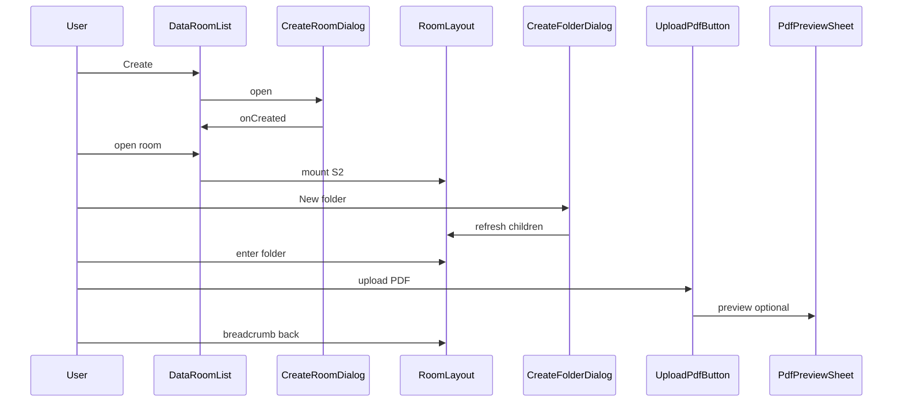

# Implementation KB — Components & Journeys

**Parent:** [07-implementation-kb.md](./07-implementation-kb.md)

Format per component: Responsibility · Props/state · Repo · Emits · UI states · Mobile · Depends · Slice · Priority · Bugs.

---

## 5. Component encyclopedia

### AppShell
| Field | Content |
|-------|---------|
| Responsibility | Root layout: theme, toaster, repo context provider, route/state switch S1↔S2 |
| Props / state | `repo`; optional `persistenceDegraded` |
| Repo | provides via context |
| Emits | — |
| UI states | loading repo init |
| Mobile | full viewport height |
| Depends | DataRoomList, RoomLayout, sonner |
| Slice | 0–2 |
| Priority | Must |
| Bugs | Mounting both S1 and S2; missing Toaster |

### DataRoomList
| Field | Content |
|-------|---------|
| Responsibility | S1: list rooms, empty, create entry |
| Props / state | `rooms[]`, `loading`, `error` |
| Repo | `listRooms`, navigate open |
| Emits | `onOpenRoom(id)` |
| UI states | empty / loading / populated / error |
| Mobile | stacked cards/rows |
| Depends | DataRoomRow, CreateRoomDialog, EmptyRoomsState, SeedSampleButton |
| Slice | 2 |
| Priority | Must |
| Bugs | Not refreshing after create |

### DataRoomCard / DataRoomRow
| Field | Content |
|-------|---------|
| Responsibility | Single room display + open + optional delete |
| Props / state | `room`; menu open |
| Repo | `deleteRoom` if DR-06 |
| Emits | `onOpen`, `onDelete` |
| UI states | default / confirm delete |
| Mobile | large tap target |
| Depends | DeleteConfirmDialog |
| Slice | 2 (delete in 5) |
| Priority | Must / delete Should |
| Bugs | Delete without cascade |

### CreateRoomDialog
| Field | Content |
|-------|---------|
| Responsibility | Name input → create room |
| Props / state | `open`, `name`, `submitting` |
| Repo | `createRoom` |
| Emits | `onCreated(room)`, `onOpenChange` |
| UI states | validation error empty name |
| Mobile | full-width dialog |
| Depends | shadcn Dialog, Input, Button |
| Slice | 2 |
| Priority | Must |
| Bugs | Allow whitespace-only names |

### EmptyRoomsState
| Field | Content |
|-------|---------|
| Responsibility | CTA when no rooms |
| Props / state | — |
| Repo | — |
| Emits | `onCreate`, `onSeed` |
| UI states | only empty |
| Mobile | centered copy |
| Depends | SeedSampleButton optional |
| Slice | 2,5 |
| Priority | Must |
| Bugs | Dead “Learn more” links |

### SeedSampleButton
| Field | Content |
|-------|---------|
| Responsibility | One-click demo structure |
| Props / state | `busy` |
| Repo | `seedSample` |
| Emits | `onSeeded(room)` → open room |
| UI states | idle / busy |
| Mobile | same |
| Depends | repo seed |
| Slice | 5 |
| Priority | Should |
| Bugs | Seeding twice duplicates without unique names |

### RoomLayout
| Field | Content |
|-------|---------|
| Responsibility | S2 chrome: breadcrumbs + toolbar + list + preview host |
| Props / state | `roomId`, `parentId`, `children`, `previewFileId` |
| Repo | `listChildren`, `getBreadcrumbs` |
| Emits | navigate folder; set preview |
| UI states | loading children / error / empty / populated |
| Mobile | sticky toolbar; sheet preview |
| Depends | Breadcrumbs, Toolbar, NodeList, EmptyFolderState, PdfPreviewSheet |
| Slice | 3 |
| Priority | Must |
| Bugs | Stale children after mutation |

### Breadcrumbs
| Field | Content |
|-------|---------|
| Responsibility | Room → ancestors → current; click to navigate |
| Props / state | `items: {id,name}[]`, room name |
| Repo | via parent (`getBreadcrumbs`) |
| Emits | `onNavigate(folderId \| null)` |
| UI states | root-only vs deep |
| Mobile | horizontal scroll truncate middle |
| Depends | shadcn Breadcrumb |
| Slice | 3 |
| Priority | Must |
| Bugs | Broken parent chain → crash (guard) |

### Toolbar
| Field | Content |
|-------|---------|
| Responsibility | Actions for current folder |
| Props / state | — |
| Repo | — (children call) |
| Emits | — |
| UI states | — |
| Mobile | wrap buttons / icon+label |
| Depends | NewFolderButton, UploadPdfButton, (SearchInput) |
| Slice | 3–4 |
| Priority | Must |
| Bugs | Showing Search before Extra implemented |

### NewFolderButton
| Field | Content |
|-------|---------|
| Responsibility | Open CreateFolderDialog |
| Props / state | — |
| Repo | — |
| Emits | open dialog |
| Slice | 3 |
| Priority | Must |
| Bugs | — |

### UploadPdfButton
| Field | Content |
|-------|---------|
| Responsibility | Hidden file input accept PDF → upload |
| Props / state | `uploading` |
| Repo | `uploadFile` |
| Emits | refresh list; toast if renamed |
| UI states | uploading disabled |
| Mobile | works with OS picker |
| Depends | validate via repo |
| Slice | 4 |
| Priority | Must |
| Bugs | Missing `accept`; no toast on `(n)` rename |

### SearchInput (Extra)
| Field | Content |
|-------|---------|
| Responsibility | Filter current children by name |
| Props / state | `query` |
| Repo | none (client filter) |
| Slice | Extra after 8 |
| Priority | Extra |
| Bugs | Mounting without filter logic |

### NodeList
| Field | Content |
|-------|---------|
| Responsibility | Render folders then files; optional DnD context |
| Props / state | `nodes`, `selectedId?` |
| Repo | — |
| Emits | open / preview / action menu |
| UI states | empty handled by parent |
| Mobile | comfortable row height ≥44px |
| Depends | FolderRow, FileRow |
| Slice | 3–4 |
| Priority | Must |
| Bugs | Mixing sort randomly |

### FolderRow
| Field | Content |
|-------|---------|
| Responsibility | Show folder; click enter; actions |
| Props / state | `node`; dnd attrs if MV-04 |
| Repo | via menu |
| Emits | `onOpen(id)` |
| UI states | drop-target highlight |
| Mobile | drag handle if DnD |
| Depends | NodeActionsMenu, DropIndicator |
| Slice | 3 |
| Priority | Must |
| Bugs | Click navigates while dragging |

### FileRow
| Field | Content |
|-------|---------|
| Responsibility | Show PDF row; click preview; size/date |
| Props / state | `node` |
| Repo | — |
| Emits | `onPreview(id)` |
| UI states | — |
| Mobile | truncate name |
| Depends | NodeActionsMenu; FI-09 formatBytes |
| Slice | 4 |
| Priority | Must |
| Bugs | Preview without revoke old URL |

### NodeActionsMenu
| Field | Content |
|-------|---------|
| Responsibility | Kebab: Rename, Delete, Move… |
| Props / state | `node` |
| Repo | — opens dialogs |
| Emits | action type |
| UI states | — |
| Mobile | stopPropagation on trigger |
| Depends | Rename/Delete/Move dialogs |
| Slice | 3–4; Move in 7 |
| Priority | Should (inline buttons OK for Must) |
| Bugs | Menu items that no-op |

### DropIndicator
| Field | Content |
|-------|---------|
| Responsibility | Visual drop affordance on folder |
| Slice | 7 Should+ |
| Priority | Should+ |
| Bugs | Blocks scrolling (`touch-action: none` on whole row) |

### EmptyFolderState
| Field | Content |
|-------|---------|
| Responsibility | Empty directory CTAs |
| Emits | create folder / upload |
| Slice | 3–5 |
| Priority | Must |
| Bugs | Only text, no actions |

### PdfPreviewSheet
| Field | Content |
|-------|---------|
| Responsibility | S3: load blob → object URL → iframe; Open/Download/Close |
| Props / state | `fileId`, `open`, `url`, `error` |
| Repo | `getFileBlob` |
| Emits | `onOpenChange` |
| UI states | loading / error / ready |
| Mobile | prefer Sheet; always show Open + Download |
| Depends | Sheet/Dialog |
| Slice | 4 |
| Priority | Must |
| Bugs | Leak object URLs; no fallback |

### RenameDialog
| Field | Content |
|-------|---------|
| Responsibility | Edit name → `renameNode` |
| Repo | `renameNode` |
| Slice | 3–4 |
| Priority | Must |
| Bugs | Not applying uniqueName toast |

### DeleteConfirmDialog
| Field | Content |
|-------|---------|
| Responsibility | Confirm destructive; show N for folders |
| Repo | `deleteFolder` / `deleteFile` / `deleteRoom` |
| Slice | 3–4 |
| Priority | Must |
| Bugs | Cancel still deletes; wrong N |

### MoveDialog
| Field | Content |
|-------|---------|
| Responsibility | Pick destination folder (same room) → `moveNode` |
| Props / state | tree or flat folder list; disable invalid targets |
| Repo | `listChildren` recursive or all folders; `moveNode` |
| Slice | 7 |
| Priority | Should |
| Bugs | Allow move into descendant |

### CreateFolderDialog
| Field | Content |
|-------|---------|
| Responsibility | Name → `createFolder` |
| Repo | `createFolder` |
| Slice | 3 |
| Priority | Must |
| Bugs | Same as CreateRoomDialog empty name |

---

## Domain modules (non-UI)

| Module | Slice | Priority | Notes |
|--------|-------|----------|-------|
| `types.ts` | 1 | Must | |
| `naming.ts` | 1 | Must | uniqueName |
| `cascade.ts` | 1 | Must | collectDescendants |
| `validatePdf.ts` | 1 | Must | used by uploadFile |
| `repository.ts` | 1 | Must | interface |
| `memoryRepo.ts` | 1 | Must | |
| `idbRepo.ts` | 6 | Must | |

---

## 6. Screen & journey wiring

### Journey A — Populate room

**Mounted:** AppShell → DataRoomList → CreateRoomDialog → RoomLayout → Breadcrumbs/Toolbar/NodeList → dialogs → PdfPreviewSheet

### Journey B — Cascade

User in RoomLayout → NodeActionsMenu Delete on folder → DeleteConfirmDialog (N) → `deleteFolder` → list refresh. Components: FolderRow, DeleteConfirmDialog, cascade in repo.

### Journey C — Same-name

UploadPdfButton twice → repo uniqueName → toast “Saved as a (1).pdf” → NodeList shows both.

### Journey D — Move

NodeActionsMenu → MoveDialog → select folder → `moveNode` → refresh. Invalid targets disabled. Optional: FolderRow DnD → same repo method.
